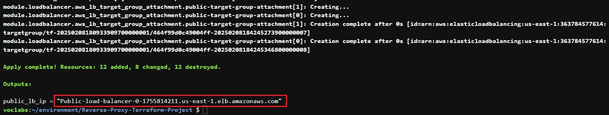
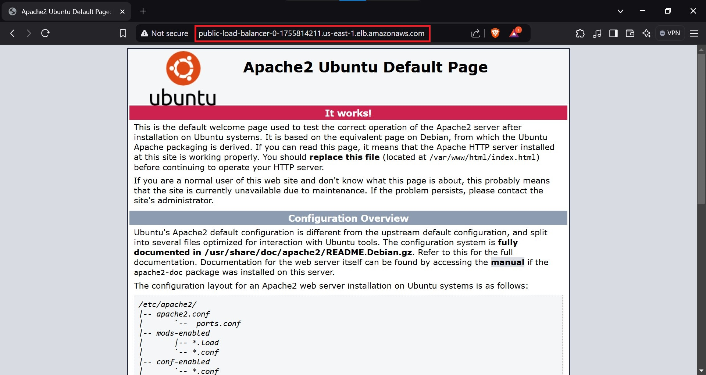

---

# Reverse Proxy Configuration with Terraform

## Description
This project automates the deployment of a secure AWS cloud infrastructure using Terraform. The setup includes a Virtual Private Cloud (VPC) with public and private subnets across two availability zones. Public subnets host Nginx reverse proxy instances and an internet-facing Application Load Balancer (ALB), while private subnets contain Apache web servers and an internal ALB. The reverse proxy enhances security by shielding backend servers from direct internet exposure and routing traffic through the public ALB to private resources.
## Architecture Diagram


## Table of Contents
- [Modules](#modules)
- [Infrastructure Overview](#infrastructure-overview)
- [Prerequisites](#prerequisites)
- [Getting_Started](#Getting_Started)
- [Cleanup](#Cleanup)


## Modules
1. **VPC Module**: Configures a VPC with CIDR block, public/private subnets, route tables, internet gateway, and NAT gateway (for private subnet internet access).
2. **Subnets Module**: Creates public and private subnets across two availability zones. Public subnets have direct internet access, while private subnets route traffic through the NAT gateway.
3. **EC2 Module**: Deploys EC2 instances: Public Subnets host Nginx reverse proxy servers configured with user data scripts for automatic setup, while Private Subnets contain Apache web servers set up with user data scripts for installation and configuration.
4. **Load Balancer Module**: Public ALB directs internet traffic to Nginx proxies, while Private ALB routes traffic from proxies to Apache servers.

## Infrastructure Overview
The infrastructure is structured as follows:

- **VPC**: Isolated network environment with CIDR 10.0.0.0/16.
- **Subnets**:
  - Public Subnets: Host Nginx proxies and public ALB. Configured with route tables for internet access via an Internet Gateway.
  - Private Subnets: Host Apache servers and private ALB. Outbound traffic uses a NAT Gateway.
- **Security Groups**:
  - Public Instances: Allow HTTP/HTTPS from any IP and SSH from trusted IPs (configurable).
  - Private Instances: Restrict HTTP/HTTPS traffic to the public subnets; SSH is allowed only from public instances.
- **Load Balancers**
  - Public ALB: Listens on ports 80, and forwards traffic to Nginx proxies.
  - Private ALB: Routes requests from proxies to Apache servers.

## Prerequisites
- AWS Account: With IAM permissions for VPC, EC2, ALB, and IAM.
- AWS CLI: Configured with credentials (aws configure).
- Terraform: Installed locally. See [Terraform Installation Guide](https://learn.hashicorp.com/tutorials/terraform/install-cli) for instructions.

## Getting_Started
1. Clone the Repository:
  ```
    git clone https://github.com/abdelhamed-4A/Terraform-Reverse-Proxy-Project.git
  ```
2. Navigate to the project directory.
  ```
    cd Terraform-Reverse-Proxy-Project
  ```
3. Run `terraform init` to initialize the working directory.
  ```
    terraform init
  ```
4. Run `terraform plan` to review the planned changes.
  ```
    terraform plan
  ```
5. Run `terraform apply` to apply the Terraform configuration and create the infrastructure.
  ```
    terraform apply -auto-approve
  ```
6. After successful provisioning, access AWS Management Console to view the deployed resources.

## The Output will be :



## Copy and paste it into your browser. This will show you the following page:




## Cleanup
To avoid AWS charges, destroy the infrastructure when done:
  ```
    terraform destroy -auto-approve
  ```
